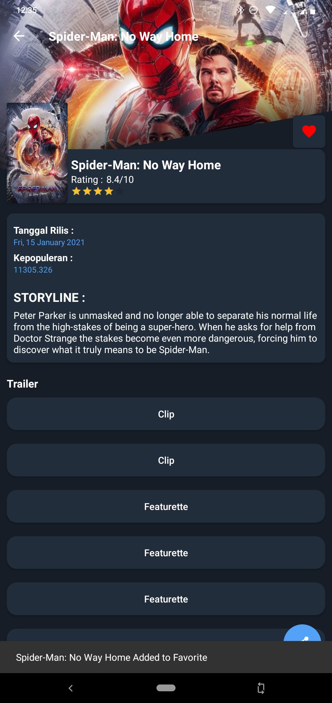

# MovieApp


### No Way Home Group:

- Fakhri Faishal Rochdiana (1197050040)
- Muhamad Taopik (1197050081)
- Naufal Rizqullah (1197050095)
- Reyhan Afrizal (1197050114)

Pengembangan Aplikasi Mobile

# Referensi


Referensi diambil dari [sini](https://bit.ly/3Hy0y9k).

**or**

```
https://bit.ly/3Hy0y9k
```

# API Services IMDB


API tersebut diambil dari [sini](https://developers.themoviedb.org/3/g).

**or**

```
https://developers.themoviedb.org/3/g
```

# Layout


Berikut beberapa tampilan pada aplikasi `MovieApp`.

<h4>1. Tampilan Movie</h4>


<h4>2. Tampilan Search Movie</h4>


<h4>3. Tampilan Detail Movie</h4>


<h4>4. Tampilan Add Movie to Favorite</h4>




<h4>5. Tampilan Share Movie</h4>


<h4>6. Tampilan Tv Show</h4>


<h4>7. Tampilan Search Tv Show</h4>


<h4>8. Tampilan Favorite Movie dan Tv Show</h4>


<h4>9. Tampilan Remove Favorite Movie</h4>


# Social Media


y'all can find my `social media` here:
 
<p align='center'>
 
 <a href="https://www.facebook.com/mr.94t3z">
          
 </a>&nbsp;&nbsp;
 
 <a href="https://www.instagram.com/m.taopik_/">
   
 </a>&nbsp;&nbsp;
 
 <a href="https://www.linkedin.com/in/muhamad-taopik-8b0746174">
  
 </a>&nbsp;&nbsp;
 
 <a href="https://twitter.com/mr94t3z">
  
 </a>&nbsp;&nbsp;
  
</p>

<p align='center'>
 <a href="#">
  
 </a>
</p>
